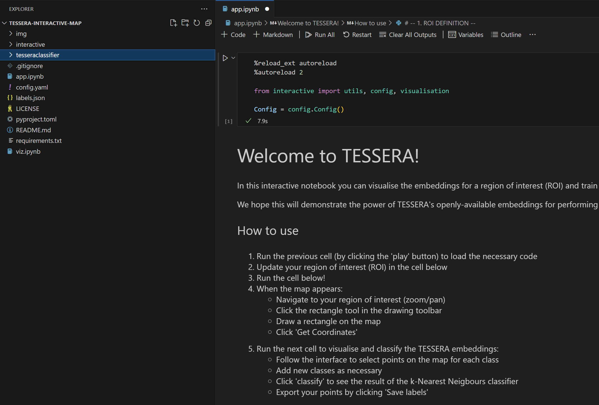
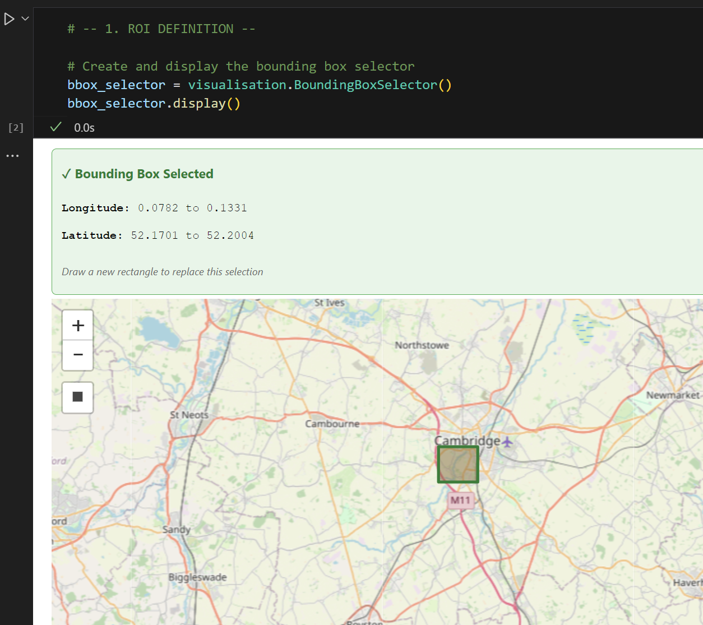

# Interactive Tessera Embedding Classifier

This repository contains a Jupyter notebook based tool for interactive, human-in-the-loop classification of geospatial data using the [Tessera foundation model](https://github.com/ucam-eo/tessera) embeddings.

The tool allows a user to define an area of interest, visualize the high-dimensional embedding data with PCA, and iteratively train a machine learning model by simply clicking on the map to label.

## Features

-   **Interactive Map Interface**: Pan and zoom on a satellite or terrain basemap.
-   **Data-Driven Visualization**: Uses PCA to create a false-color visualization of Tessera embeddings.
-   **Point-and-Click Training**: Simply click on the map to add labeled training points.
-   **Custom Classes & Colors**: Dynamically add new classes and customize their colors with a color picker.
-   **Live Classification**: Train a k-Nearest Neighbors model and classify the map with a click.
-   **Iterative Refinement**: Add more pins to correct mistakes and re-run the classification for immediate (relatively) feedback.

## Installation

This tool is designed to run in a local Python environment.

1.  **Clone the Repository**:
    ```bash
    git clone https://github.com/ucam-eo/tessera-interactive-map.git
    cd tessera-interactive-map
    ```
    (workshop participants, skip the next steps, environment management has been done for you; go directly to running the notebook)
    
3.  **Create and Activate a Virtual Environment**:
    ```bash
    python -m venv venv
    source venv/bin/activate
    ```

4.  **Install Dependencies**:
    The required packages are listed in `requirements.txt`. Additionally, you need to install the `geotessera` library directly from its Git repository.

    ```bash
    pip install -r requirements.txt
    pip install git+https://github.com/ucam-eo/geotessera.git
    ```
    For jupyter lab, also run `python -m ipykernel install --user --name=tessera` to register the kernel
    
## How to Run

1.  **Open the Project**:
    Open the cloned repository folder in VS Code or Jupyter Notebook, or whatever else that runs ipynb files.

2.  **Open the Notebook**:
    Using the file browser on the left, find and open the main notebook file.

3.  **Run the Cells**:
    The notebook is organized into sequential steps. Run each cell in order from top to bottom.

    -   **Step 1: Setup**: Defines the Region of Interest (ROI) by setting latitude/longitude boundaries.
    -   **Step 2: Data Fetching & Visualization**: Downloads the required Tessera embedding tiles for your ROI, stitches them together, and uses PCA to generate the false color image. This step may take a while.
    -   **Step 3: Interactive UI**: This is the main interface. It displays the map, the embedding overlay, and all the widgets.
    -   **Step 4: Classification Logic**: This cell defines the function that is triggered when you click the "Classify" button. **You only need to run this cell once** to define the function.

    Note: run all four stages, it's necessary to run step 4 for the classification to work even if the map appears at stage 3.
    
## How to Use the Tool

### 1. Launch the Notebook

Once the notebook opens, you're ready to begin.



---

### 2. Set the Region of Interest

Use a tool like [BBox Finder](http://bboxfinder.com) to get coordinates and define your bounding box.



---

### 3. Run All Cells

Click `Run All` to execute all the cells in the notebook. This may take a couple of minutes.


---

### 4. Wait for the Map to Load

Once processing completes, a map will appear in the notebook.


---

### 5. Select or Add a Class

Use the class selector to pick an existing class or create a new one.
You can customize the color using the color palette.


---

### 6. Label the Map

Click directly on the map to place pins for each class.
Clicking a pin again will remove it.


---

### 7. Start Classification

Once you’ve added pins from **at least two classes**, click the **Classify** button to begin the classification.


---

### 8. View the Classification Map

After processing, a classification map based on your input will appear.


