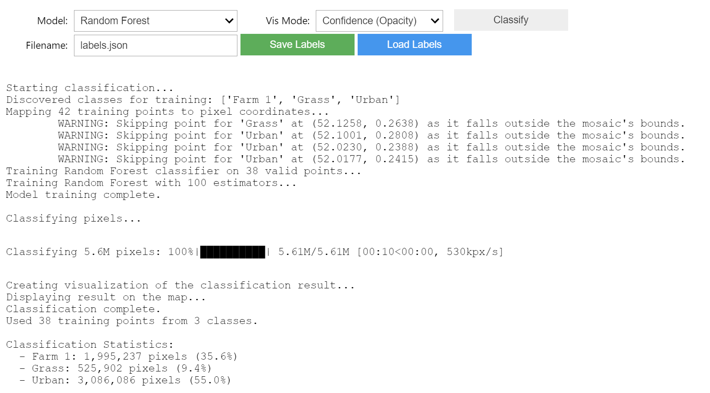

# Interactive Tessera Embedding Classifier

This repository contains a Jupyter notebook based tool for interactive, human-in-the-loop classification of geospatial data using the [Tessera foundation model](https://github.com/ucam-eo/tessera) embeddings.

The tool allows a user to define an area of interest, visualize the high-dimensional embedding data with PCA, and iteratively train a machine learning model by simply clicking on the map to label.

## Features

-   **Interactive Map Interface**: Pan and zoom on a satellite or terrain basemap.
-   **Data-Driven Visualization**: Uses PCA to create a false-color visualization of Tessera embeddings.
-   **Point-and-Click Training**: Simply click on the map to add labeled training points.
-   **Custom Classes & Colors**: Dynamically add new classes and customize their colors with a color picker.
-   **Live Classification**: Train a k-Nearest Neighbors model and classify the map with a click.
-   **Iterative Refinement**: Add more pins to correct mistakes and re-run the classification for immediate (relatively) feedback.

## Prerequisites

Before installing and running the tool, make sure you have:
- Python – install from [python.org
](https://www.python.org/downloads/) (v13 tested)
- Git – Install from [git-scm.com](https://git-scm.com/downloads)


## Installation

1.  **Clone the Repository**:
    ```bash
    git clone https://github.com/ucam-eo/tessera-interactive-map.git
    cd tessera-interactive-map
    ```
    
3.  **Create and Activate a Virtual Environment**:
    ```bash
    python -m venv venv
    source venv/bin/activate
    ```

4.  **Install Dependencies**:
    The required packages are listed in `requirements.txt`.

    ```bash
    pip install -r requirements.txt
    ```
    For jupyter lab, also run `python -m ipykernel install --user --name=venv` to register the kernel

## How to Use the Tool

### 1. Open the Project
Open the cloned repository folder in VS Code or Jupyter Notebook, or whatever else that runs ipynb files.

---

### 2. Launch the Notebook

Using the file browser on the left, find and open the `app.ipynb` file.


---

### 3. Initialize the Environment

Once the notebook opens, you're ready to begin. Run the top cell to load the required packages and set up the environment.

---

### 4. Set the Region of Interest

Run the ROI selector cell. Define your bounding box with the tool by dragging a square.


---

### 5. Generate the Interactive Map

Click `Run` to execute the cell below the ROI selector in the notebook. This may take a couple of minutes.


---

### 6. Wait for the Map to Load

Once processing completes, a map will appear in the notebook.


---

### 7. Select or Add a Class

Use the class selector to pick an existing class or create a new one.
You can customize the color using the color palette.


---

### 8. Label the Map

Click directly on the map to place pins for each class.
Clicking a pin again will remove it.


---

### 9. Start Classification

Once you’ve added pins from **at least two classes**, click the **Classify** button to begin the classification.



---

### 10. View the Classification Map

After processing, a classification map based on your input will appear. You may iterate on this by adding or removing labels or classes and reclassifying.


